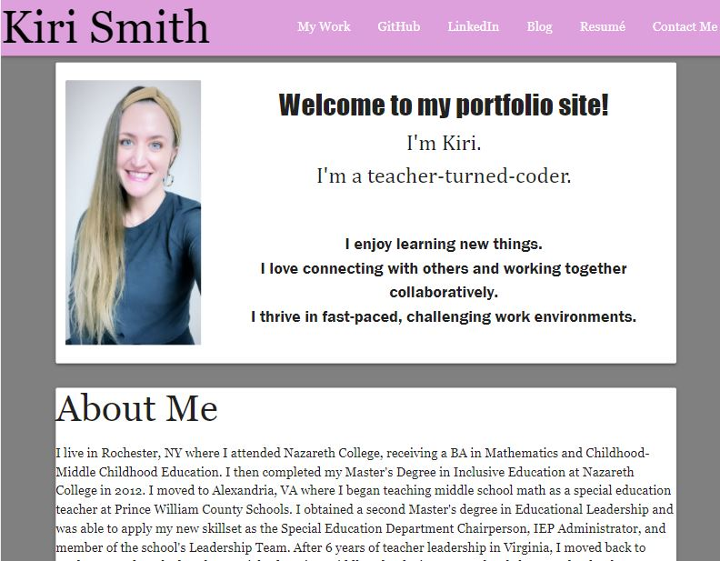

# updated-portfolio

For this project, I used HTML and CSS to create an updated portfolio. The portfolio contains my contact information, links to my github and linkedin profiles, and three showcased repositories/apps. I incorporated Materialize to style the portfolio and then added custom styling in the CSS document and added features for mobile responsiveness.

## Snapshot

## Built With

* [Visual Studio Code](https://code.visualstudio.com/) - to create and modify the code on my local device
* [HTML](https://developer.mozilla.org/en-US/docs/Web/HTML) - to create elements
* [CSS](https://developer.mozilla.org/en-US/docs/Web/CSS) - to style the html elements
* [Materialize](https://materializecss.com/) - to style the containers and nav bars
* [Git](https://git-scm.com/) - to track changes and push commits
* [GitHub](github.com) - to host the repository and deploy with GitHub pages

## Deployed Link

* [ https://kiri-smith.github.io/portfolio-update/](#)

## Author

* Kiri Smith 

- [https://github.com/kiri-smith](https://github.com/)
- [https://www.linkedin.com/in/kiri-lynne-smith/](https://www.linkedin.com/)
- [https://medium.com/@kirilynne](https://medium.com/)

## License

This project is licensed under the MIT License.